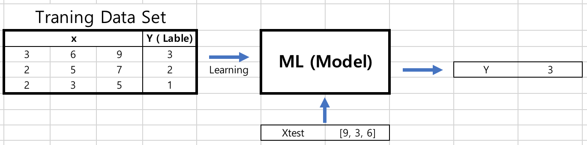

# LECUTRE01 Terms and Concept

## 1.Basic Concept

### 1.1. Limitations of explicit programming

1.1.1 Supervised Learning

- learning with labeled examples - training set
- Image labeling : learning from tagged images
- Email spam filter : learning from labled (spam or ham) email
- Predicting exam score : learning from previous exam score and time spent
- Predicting final exam score based on time spent
 - regression  
- Pass/non-pass based on time spent
 - binary calssification
- Letter grade (A, B, C, D and F) based on time spent
 - multi-label classification

1.1.2 Unsupervised learning : un-labled data
- Google news grouping
- Word clustering
